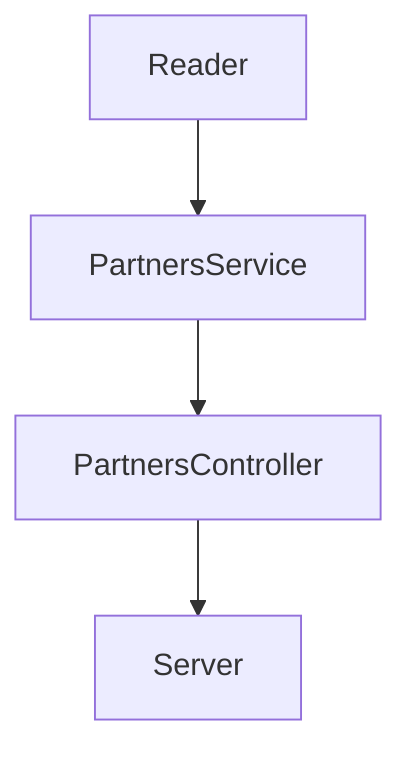

# Visual Thinking Students API

API que lee la información de los estudiantes (partners) inscritos en los cursos
de Visual Thinking cuyos datos se encuentran en visualpartners.json

Explico cómo desarrollé este proyecto paso a paso desde la instalación de las
dependencias [en esta entrada de mi blog](https://pagutri.github.io/my_launchx_blog/posts/post_07/).

## Dependencias

| Dependencia | Versión | Usada para |
|---|---|---|
| [NODE](https://nodejs.org/en/docs/) | 16.14.2 | Escribir el código de javascript |
| [Jest](https://archive.jestjs.io/docs/en/22.x/getting-started.html) | 26.0.0 | Realizar pruebas de unidad |
| [Express](https://expressjs.com/) | 4.18.1 | Montar el servidor |
| [Eslint](https://eslint.org/docs/user-guide/getting-started) | 8.15.0 | Corregir estilo del código |

## Estructura del proyecto

## Cómo consultar la API

1. Clonar el repositorio.
2. Instalar dependencias.
3. Desde la terminal, ubicarse en el directorio raíz del repo y correr el comando `npm run server`.
4. Ingresar desde el navegador a `localhost:3000/partners` para ver los datos de los partners.
5. Ingresar desde el navegador a `localhost:3000/partners/emails` para ver los emails de los partners certificados.
6. Ingresar desde el navegador a `localhost:3000/partners/credits500` para ver los datos de los partners con más de 500 cŕeditos.

